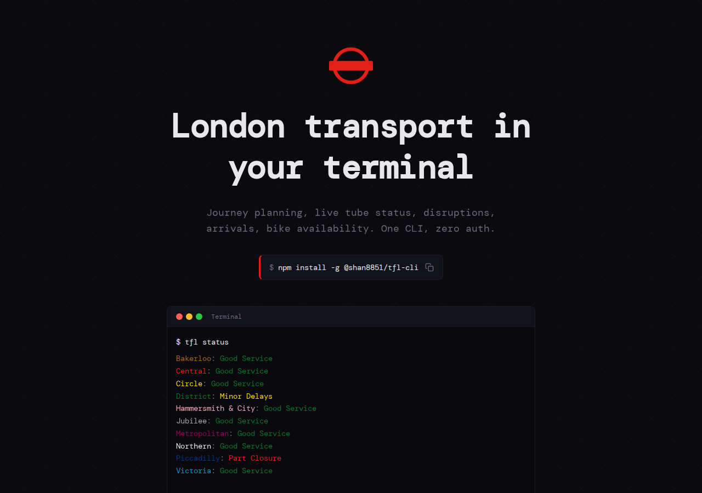
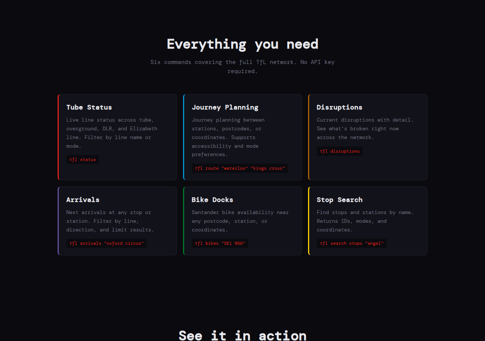
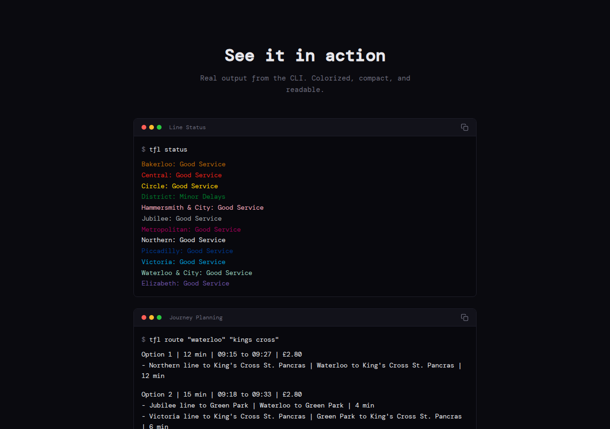
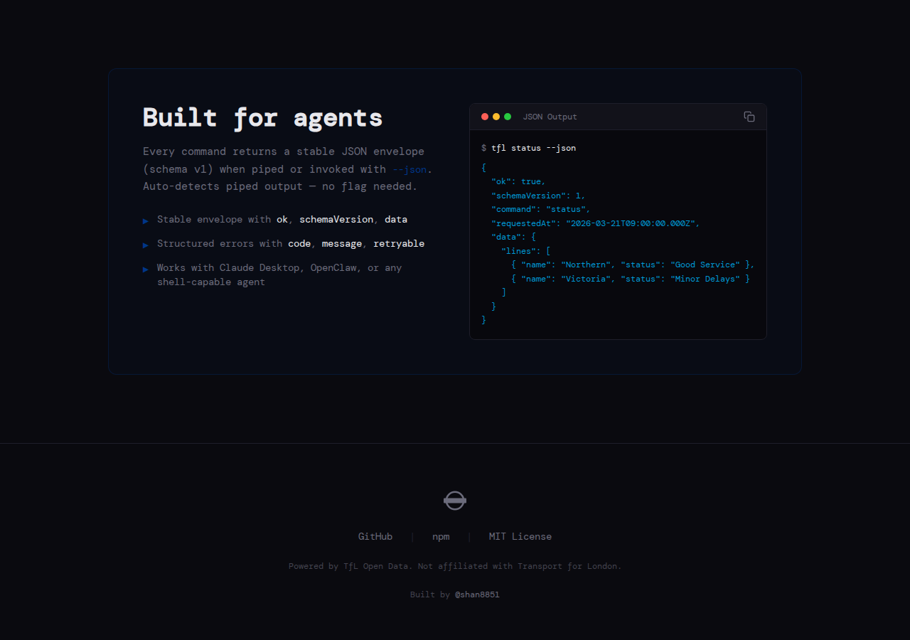

# 🚇 tfl-cli-ui

Landing page for [@shan8851/tfl-cli](https://www.npmjs.com/package/@shan8851/tfl-cli) — London transport in your terminal.

**🌐 [tfl-cli.xyz](https://tfl-cli.xyz)** · **📦 [npm](https://www.npmjs.com/package/@shan8851/tfl-cli)** · **💻 [CLI source](https://github.com/shan8851/tfl-cli)**



## Sections

### Features

Six commands covering tube status, journey planning, disruptions, arrivals, bike docks, and stop search — each with a tube-line-coloured accent.



### Examples

Real CLI output rendered in terminal chrome with colour-coded line names and status indicators.



### Agent Integration

Stable JSON envelope (schema v1), auto-detected piped output, structured errors — built for Claude Desktop, OpenClaw, or any shell-capable agent.



## Tech

Vite + React 19 + TypeScript + Tailwind CSS v4. Dark theme, CSS-only animations, static SPA.

## Local dev

```bash
pnpm install
pnpm dev        # http://localhost:5173
pnpm build      # output → dist/
```

## License

MIT — Built by [@shan8851](https://x.com/shan8851)
